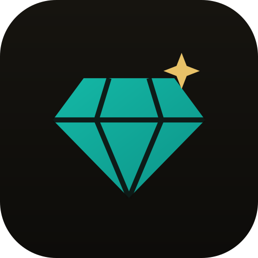
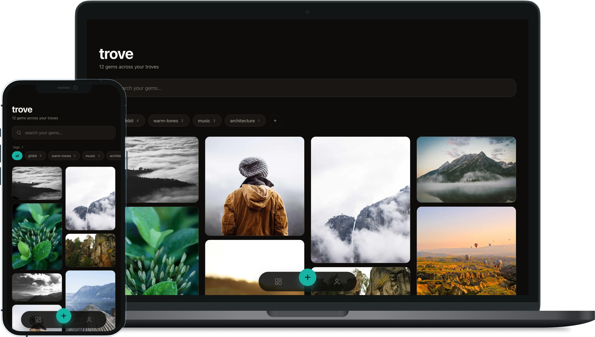

  

<h1 align="center">trove</h1>

  A private gallery for the things worth keeping. Stash images, videos, and 
  links into troves of gems, then find any of them in a tap.

  
  
  

  

## What it is

Trove is a personal capture gallery, a Pinterest-flavored PWA for the images, videos, and links worth holding onto. Everything you save is a **gem**; gems live in **troves**. Sign in with Google and it's private by default: every row is scoped to its owner, media lives in a private bucket, and the whole thing installs to your home screen.

## Features

- **Troves of gems:** images, videos, and links, with automatic Open Graph previews for links.
- **One searchable home** across every trove. Search by description, tag, link, or title.
- **Tags:** per-gem, with a management page and a filter strip on home and inside troves.
- **A gesture-driven lightbox:** swipe to dismiss, swipe between gems, prev/next arrows, and an inline editable description.
- **Reorder** troves and gems by dragging, and **bulk-select** to move or delete in batches.
- **Private by design:** Google sign-in, per-user isolation through row-level security, media served via short-lived signed URLs.
- **Installable PWA** with a tuned manifest, real icons, and an offline fallback.

## Good to know

- **Install it.** Open Trove in a browser and use _Add to Home Screen_ on iOS or the install icon in a desktop browser for a full-screen, app-like experience.
- **It's a private shelf.** Single-user by design: no sharing, follows, comments, or public links.
- **Link previews need Open Graph.** Most sites expose a preview image and title; a few (such as TikTok) get special handling, and some won't preview at all.

## Contributing

Issues and PRs are welcome. See [CONTRIBUTING.md](CONTRIBUTING.md), which covers the stack, running it locally, and the conventions.

## License

All code and content unique to Trove is licensed under MIT. See [LICENSE](LICENSE).
